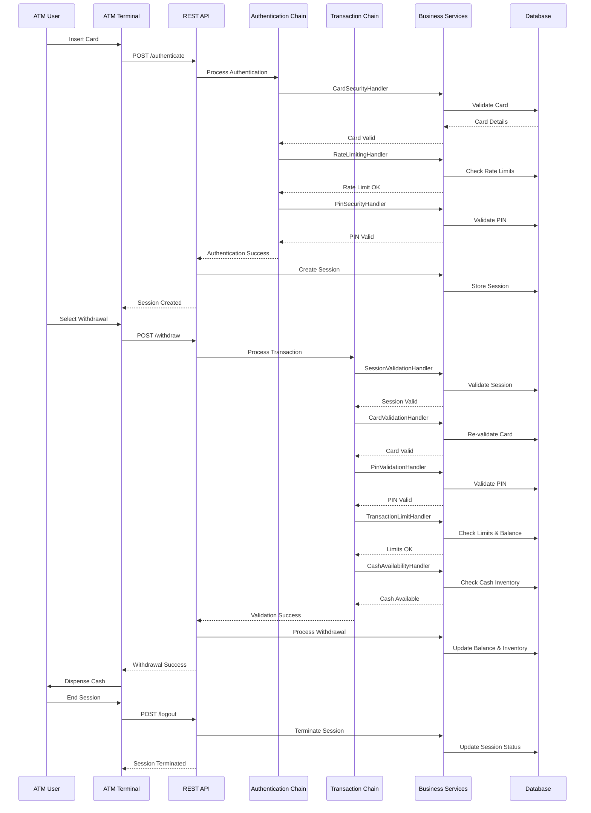
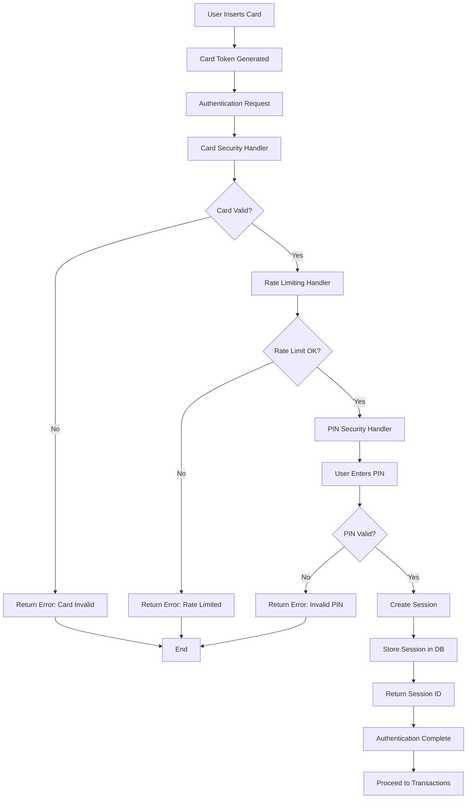
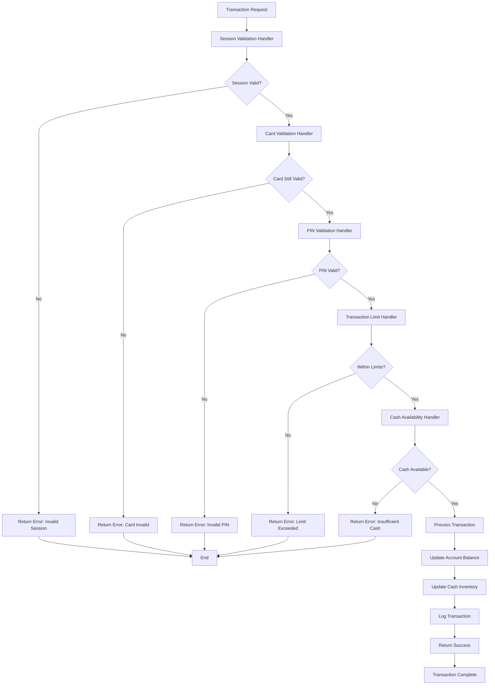

# ATM Low Level Design (LLD) System

A comprehensive ATM (Automated Teller Machine) system implementation using Spring Boot, demonstrating enterprise-level design patterns, security best practices, and scalable architecture.

## 📋 Table of Contents

- [Overview](#overview)
- [Architecture](#architecture)
- [Design Patterns](#design-patterns)
- [System Components](#system-components)
- [API Endpoints](#api-endpoints)
- [Transaction Flow](#transaction-flow)
- [Authentication Flow](#authentication-flow)
- [Database Schema](#database-schema)
- [Security Features](#security-features)
- [Setup & Installation](#setup--installation)
- [Configuration](#configuration)
- [Testing](#testing)
- [Deployment](#deployment)
- [Contributing](#contributing)

## 🎯 Overview

This ATM LLD system is a comprehensive implementation of an Automated Teller Machine backend service that handles:

- **User Authentication** with PIN validation and security checks
- **Cash Withdrawal** with denomination distribution and inventory management
- **Balance Inquiry** with real-time account information
- **Session Management** with timeout and security controls
- **Transaction Processing** with comprehensive validation chains
- **Audit & Logging** for compliance and monitoring

### Key Features

- ✅ **Chain of Responsibility Pattern** for modular validation
- ✅ **Session-based Authentication** with timeout management
- ✅ **Multi-layer Security** with rate limiting and fraud detection
- ✅ **ISO 8583 Compliance** for financial transaction standards
- ✅ **PCI DSS Compliant** card tokenization
- ✅ **Comprehensive Audit Trail** for all operations
- ✅ **Scalable Architecture** with Spring Boot and JPA
- ✅ **Database Agnostic** with H2, MySQL, and PostgreSQL support

## 🏗️ Architecture

### High-Level Architecture

```
┌─────────────────┐    ┌─────────────────┐    ┌─────────────────┐
│   ATM Client    │    │   Web Browser   │    │  Mobile App     │
└─────────┬───────┘    └─────────┬───────┘    └─────────┬───────┘
          │                      │                      │
          └──────────────────────┼──────────────────────┘
                                 │
                    ┌─────────────▼─────────────┐
                    │   REST API Gateway        │
                    │   (Spring Boot)           │
                    └─────────────┬─────────────┘
                                  │
                    ┌─────────────▼─────────────┐
                    │   Controller Layer        │
                    │   (AtmTransactionController)│
                    └─────────────┬─────────────┘
                                  │
                    ┌─────────────▼─────────────┐
                    │   Chain of Responsibility │
                    │   (Authentication &       │
                    │    Transaction Chains)    │
                    └─────────────┬─────────────┘
                                  │
                    ┌─────────────▼─────────────┐
                    │   Service Layer           │
                    │   (Business Logic)        │
                    └─────────────┬─────────────┘
                                  │
                    ┌─────────────▼─────────────┐
                    │   Repository Layer        │
                    │   (Data Access)           │
                    └─────────────┬─────────────┘
                                  │
                    ┌─────────────▼─────────────┐
                    │   Database Layer          │
                    │   (H2/MySQL/PostgreSQL)   │
                    └───────────────────────────┘
```

### Component Architecture

```
┌─────────────────────────────────────────────────────────────────┐
│                        ATM LLD System                          │
├─────────────────────────────────────────────────────────────────┤
│  Controllers                                                    │
│  ├── AtmTransactionController                                   │
│  │   ├── /api/atm/authenticate                                 │
│  │   ├── /api/atm/withdraw                                     │
│  │   ├── /api/atm/balance                                      │
│  │   └── /api/atm/logout                                       │
├─────────────────────────────────────────────────────────────────┤
│  Chain of Responsibility                                        │
│  ├── Authentication Chain                                       │
│  │   ├── CardSecurityHandler                                    │
│  │   ├── RateLimitingHandler                                    │
│  │   └── PinSecurityHandler                                     │
│  └── Transaction Chain                                          │
│      ├── SessionValidationHandler                               │
│      ├── CardValidationHandler                                  │
│      ├── PinValidationHandler                                   │
│      ├── TransactionLimitHandler                                │
│      └── CashAvailabilityHandler                                │
├─────────────────────────────────────────────────────────────────┤
│  Services                                                       │
│  ├── AtmSessionService                                          │
│  ├── AuthenticationService                                      │
│  ├── BalanceService                                             │
│  ├── CardService                                                │
│  ├── CashService                                                │
│  └── TransactionService                                         │
├─────────────────────────────────────────────────────────────────┤
│  Data Access Objects (DAOs)                                     │
│  ├── AtmMachine                                                 │
│  ├── AtmSession                                                 │
│  ├── Card                                                       │
│  ├── Transaction                                                │
│  ├── AtmCashInventory                                           │
│  └── AtmLocation                                                │
├─────────────────────────────────────────────────────────────────┤
│  Security & Infrastructure                                      │
│  ├── PIN Encryption/Decryption                                  │
│  ├── Card Tokenization                                          │
│  ├── HSM Integration                                            │
│  └── Audit Logging                                              │
└─────────────────────────────────────────────────────────────────┘
```

## 🎨 Design Patterns

### 1. Chain of Responsibility Pattern

The system extensively uses the Chain of Responsibility pattern for modular and extensible validation:

#### Authentication Chain
```java
CardSecurityHandler → RateLimitingHandler → PinSecurityHandler
```

#### Transaction Processing Chain
```java
SessionValidationHandler → CardValidationHandler → PinValidationHandler 
→ TransactionLimitHandler → CashAvailabilityHandler
```

**Benefits:**
- **Modularity**: Each handler has a single responsibility
- **Extensibility**: Easy to add new validation steps
- **Flexibility**: Can reorder or skip handlers as needed
- **Testability**: Each handler can be tested independently

### 2. Repository Pattern

Data access is abstracted through repository interfaces:
```java
@Repository
public interface AtmSessionRepository extends JpaRepository<AtmSession, Long> {
    Optional<AtmSession> findBySessionToken(String sessionToken);
    List<AtmSession> findByCardTokenAndStatus(String cardToken, SessionStatus status);
}
```

### 3. Service Layer Pattern

Business logic is encapsulated in service classes:
```java
@Service
public class AtmSessionServiceImpl implements AtmSessionService {
    // Session management logic
}
```

### 4. DTO Pattern

Data Transfer Objects for API communication:
```java
public static class AuthenticationRequestDto {
    private String cardToken;
    private String pin;
    private String sessionId;
    // ...
}
```

## 🔧 System Components

### Core Components

#### 1. Controllers
- **AtmTransactionController**: Main REST API controller handling all ATM operations

#### 2. Chain Handlers

**Authentication Chain:**
- **CardSecurityHandler**: Validates card status, expiry, and security
- **RateLimitingHandler**: Implements rate limiting and fraud detection
- **PinSecurityHandler**: Validates PIN and handles PIN-related security

**Transaction Chain:**
- **SessionValidationHandler**: Validates session status and ownership
- **CardValidationHandler**: Re-validates card for transaction
- **PinValidationHandler**: Validates PIN for transaction authorization
- **TransactionLimitHandler**: Checks daily limits and account balance
- **CashAvailabilityHandler**: Validates ATM cash availability

#### 3. Services
- **AtmSessionService**: Manages user sessions and timeouts
- **AuthenticationService**: Handles user authentication
- **BalanceService**: Manages account balance operations
- **CardService**: Handles card-related operations
- **CashService**: Manages cash inventory and dispensing
- **TransactionService**: Handles transaction processing

#### 4. Data Models
- **AtmMachine**: ATM machine information and capabilities
- **AtmSession**: User session tracking and management
- **Card**: Card information with tokenization
- **Transaction**: Transaction records with ISO 8583 compliance
- **AtmCashInventory**: Cash inventory tracking
- **AtmLocation**: ATM location and address information

## 🌐 API Endpoints

### Authentication
```http
POST /api/atm/authenticate
Content-Type: application/json

{
    "cardToken": "encrypted_card_token",
    "pin": "encrypted_pin",
    "sessionId": "optional_session_id",
    "clientIp": "192.168.1.100",
    "userAgent": "ATM-Terminal/1.0"
}
```

**Response:**
```json
{
    "success": true,
    "authenticated": true,
    "sessionId": "generated_session_id",
    "sessionTimeoutSeconds": 300,
    "message": "Authentication successful. Session created."
}
```

### Cash Withdrawal
```http
POST /api/atm/withdraw
Content-Type: application/json

{
    "cardToken": "encrypted_card_token",
    "sessionId": "session_id",
    "amount": 1000.00,
    "pin": "encrypted_pin"
}
```

**Response:**
```json
{
    "success": true,
    "withdrawalProcessed": true,
    "amount": 1000.00,
    "denominationDistribution": {
        "500": 2,
        "100": 0
    },
    "message": "Withdrawal processed successfully"
}
```

### Balance Inquiry
```http
POST /api/atm/balance
Content-Type: application/json

{
    "cardToken": "encrypted_card_token",
    "sessionId": "session_id"
}
```

**Response:**
```json
{
    "success": true,
    "currentBalance": 50000.00,
    "availableBalance": 45000.00,
    "remainingDailyLimit": 15000.00,
    "accountType": "SAVINGS",
    "message": "Balance inquiry successful"
}
```

### Logout
```http
POST /api/atm/logout
Content-Type: application/json

{
    "sessionId": "session_id"
}
```

**Response:**
```json
{
    "success": true,
    "message": "Session terminated successfully"
}
```

## 🔄 Transaction Flow

### Complete ATM Transaction Flow



### Detailed Authentication Flow



### Detailed Transaction Flow



## 🔐 Authentication Flow

### Multi-Step Authentication Process

1. **Card Insertion & Tokenization**
   - Card PAN is tokenized for security
   - Card metadata is validated (expiry, status, brand)
   - Rate limiting checks are applied

2. **PIN Entry & Validation**
   - PIN is encrypted before transmission
   - PIN is validated against stored hash
   - PIN attempt limits are enforced

3. **Session Creation**
   - Secure session token is generated
   - Session timeout is set (default: 5 minutes)
   - Session is stored with audit information

### Security Measures

- **Card Tokenization**: Real PAN is never stored, only tokens
- **PIN Encryption**: PINs are encrypted in transit and at rest
- **Rate Limiting**: Prevents brute force attacks
- **Session Management**: Automatic timeout and cleanup
- **Audit Logging**: All operations are logged for compliance

## 🗄️ Database Schema

### Core Tables

#### ATM Machine
```sql
CREATE TABLE atm_machine (
    id BIGINT PRIMARY KEY AUTO_INCREMENT,
    atm_code VARCHAR(64) UNIQUE NOT NULL,
    ifsc_code VARCHAR(11) NOT NULL,
    status VARCHAR(32) NOT NULL DEFAULT 'ACTIVE',
    supports_deposit BOOLEAN NOT NULL DEFAULT FALSE,
    supports_withdrawal BOOLEAN NOT NULL DEFAULT TRUE,
    supports_cardless BOOLEAN NOT NULL DEFAULT FALSE,
    installation_date TIMESTAMP,
    last_maintenance_date TIMESTAMP,
    cash_capacity INTEGER,
    branch_contact_number VARCHAR(15),
    software_version VARCHAR(50),
    machine_model VARCHAR(100),
    location_id BIGINT NOT NULL,
    created_at TIMESTAMP DEFAULT CURRENT_TIMESTAMP,
    updated_at TIMESTAMP DEFAULT CURRENT_TIMESTAMP ON UPDATE CURRENT_TIMESTAMP,
    version INTEGER DEFAULT 0
);
```

#### Card
```sql
CREATE TABLE card (
    id BIGINT PRIMARY KEY AUTO_INCREMENT,
    token VARCHAR(64) UNIQUE NOT NULL,
    masked_pan VARCHAR(25),
    iin VARCHAR(8),
    last4 VARCHAR(4),
    brand VARCHAR(20),
    expiry_month INTEGER,
    expiry_year INTEGER,
    status VARCHAR(20) NOT NULL DEFAULT 'ACTIVE',
    created_at TIMESTAMP DEFAULT CURRENT_TIMESTAMP,
    updated_at TIMESTAMP DEFAULT CURRENT_TIMESTAMP ON UPDATE CURRENT_TIMESTAMP,
    version INTEGER DEFAULT 0
);
```

#### ATM Session
```sql
CREATE TABLE atm_session (
    id BIGINT PRIMARY KEY AUTO_INCREMENT,
    session_token VARCHAR(128) UNIQUE NOT NULL,
    card_token VARCHAR(128) NOT NULL,
    atm_machine_id BIGINT NOT NULL,
    status VARCHAR(20) NOT NULL DEFAULT 'ACTIVE',
    session_started_at TIMESTAMP NOT NULL,
    last_activity_at TIMESTAMP NOT NULL,
    expires_at TIMESTAMP NOT NULL,
    terminated_at TIMESTAMP,
    termination_reason VARCHAR(100),
    client_ip VARCHAR(45),
    user_agent VARCHAR(500),
    api_call_count INTEGER NOT NULL DEFAULT 0,
    timeout_seconds INTEGER NOT NULL,
    metadata TEXT,
    created_at TIMESTAMP DEFAULT CURRENT_TIMESTAMP,
    updated_at TIMESTAMP DEFAULT CURRENT_TIMESTAMP ON UPDATE CURRENT_TIMESTAMP,
    version INTEGER DEFAULT 0,
    
    INDEX idx_session_token (session_token),
    INDEX idx_session_card (card_token),
    INDEX idx_session_atm (atm_machine_id),
    INDEX idx_session_status (status),
    INDEX idx_session_created (created_at),
    INDEX idx_session_last_activity (last_activity_at)
);
```

#### Transaction
```sql
CREATE TABLE atm_transaction (
    id BIGINT PRIMARY KEY AUTO_INCREMENT,
    mti VARCHAR(4) NOT NULL,
    processing_code VARCHAR(6) NOT NULL,
    stan VARCHAR(6) NOT NULL,
    rrn VARCHAR(12) NOT NULL,
    response_code VARCHAR(2),
    terminal_id VARCHAR(16) NOT NULL,
    network_id VARCHAR(3),
    amount_minor BIGINT NOT NULL,
    currency VARCHAR(3) NOT NULL,
    local_txn_datetime TIMESTAMP NOT NULL,
    status VARCHAR(20) NOT NULL DEFAULT 'PENDING',
    created_at TIMESTAMP DEFAULT CURRENT_TIMESTAMP,
    updated_at TIMESTAMP DEFAULT CURRENT_TIMESTAMP ON UPDATE CURRENT_TIMESTAMP,
    version INTEGER DEFAULT 0,
    
    INDEX idx_txn_rrn (rrn),
    INDEX idx_txn_terminal (terminal_id),
    INDEX idx_txn_time (local_txn_datetime)
);
```

## 🔒 Security Features

### 1. Card Security
- **Tokenization**: Real PAN is replaced with secure tokens
- **Masked PAN**: Only last 4 digits are stored for display
- **Expiry Validation**: Automatic card expiry checking
- **Status Validation**: Blocked/inactive card detection

### 2. PIN Security
- **Encryption**: PINs are encrypted using AES-256
- **Hashing**: PIN hashes are stored using bcrypt
- **Attempt Limiting**: Maximum PIN attempts per session
- **Rate Limiting**: Prevents brute force attacks

### 3. Session Security
- **Secure Tokens**: Cryptographically secure session tokens
- **Timeout Management**: Automatic session expiration
- **Activity Tracking**: Last activity monitoring
- **IP Validation**: Client IP tracking and validation

### 4. Transaction Security
- **Amount Validation**: Min/max withdrawal limits
- **Daily Limits**: Per-card daily transaction limits
- **Balance Validation**: Sufficient balance checking
- **Cash Availability**: ATM cash inventory validation

### 5. Audit & Compliance
- **Comprehensive Logging**: All operations are logged
- **ISO 8583 Compliance**: Financial transaction standards
- **PCI DSS Compliance**: Payment card industry standards
- **Data Retention**: Configurable audit trail retention

## 🚀 Setup & Installation

### Prerequisites

- **Java 21+**
- **Maven 3.6+** or **Gradle 7.0+**
- **Database**: H2 (embedded), MySQL 8.0+, or PostgreSQL 13+

### Quick Start

1. **Clone the repository**
   ```bash
   git clone <repository-url>
   cd ATM_LLD
   ```

2. **Build the project**
   ```bash
   ./gradlew build
   ```

3. **Run the application**
   ```bash
   ./gradlew bootRun
   ```

4. **Access the application**
   - API Base URL: `http://localhost:8080/api/atm`
   - H2 Console: `http://localhost:8080/h2-console` (if using H2)

### Database Setup

#### H2 Database (Default)
No additional setup required. H2 runs in-memory by default.

#### MySQL Setup
```sql
CREATE DATABASE atm_lld;
CREATE USER 'atm_user'@'localhost' IDENTIFIED BY 'secure_password';
GRANT ALL PRIVILEGES ON atm_lld.* TO 'atm_user'@'localhost';
FLUSH PRIVILEGES;
```

#### PostgreSQL Setup
```sql
CREATE DATABASE atm_lld;
CREATE USER atm_user WITH PASSWORD 'secure_password';
GRANT ALL PRIVILEGES ON DATABASE atm_lld TO atm_user;
```

## ⚙️ Configuration

### Application Properties

```yaml
# Database Configuration
spring:
  datasource:
    url: jdbc:h2:mem:atm_lld
    username: sa
    password: 
    driver-class-name: org.h2.Driver
  
  jpa:
    hibernate:
      ddl-auto: create-drop
    show-sql: true
    properties:
      hibernate:
        format_sql: true

# ATM Configuration
atm:
  session:
    timeout-seconds: 300
    max-attempts: 3
  
  cash:
    min-withdrawal-amount: 100
    max-withdrawal-amount: 20000
    withdrawal-multiple: 100
  
  security:
    pin-encryption-key: your-encryption-key-here
    rate-limit:
      max-attempts-per-minute: 5
      max-attempts-per-hour: 20

# Logging Configuration
logging:
  level:
    com.umesh.atm: DEBUG
    org.springframework.security: DEBUG
  pattern:
    console: "%d{yyyy-MM-dd HH:mm:ss} - %msg%n"
    file: "%d{yyyy-MM-dd HH:mm:ss} [%thread] %-5level %logger{36} - %msg%n"
```

### Environment-Specific Configuration

#### Development
```yaml
# application-dev.yml
spring:
  datasource:
    url: jdbc:h2:mem:atm_lld_dev
  jpa:
    show-sql: true

logging:
  level:
    root: INFO
    com.umesh.atm: DEBUG
```

#### Production
```yaml
# application-prod.yml
spring:
  datasource:
    url: jdbc:mysql://localhost:3306/atm_lld
    username: ${DB_USERNAME}
    password: ${DB_PASSWORD}
  jpa:
    show-sql: false

logging:
  level:
    root: WARN
    com.umesh.atm: INFO
  file:
    name: /var/log/atm/application.log
```

## 🧪 Testing

### Running Tests

```bash
# Run all tests
./gradlew test

# Run specific test class
./gradlew test --tests "AtmTransactionControllerTest"

# Run tests with coverage
./gradlew test jacocoTestReport
```

### Test Structure

```
src/test/java/com/umesh/atm/
├── controller/
│   └── AtmTransactionControllerTest.java
├── service/
│   ├── AtmSessionServiceTest.java
│   ├── AuthenticationServiceTest.java
│   └── CashServiceTest.java
├── chain/
│   ├── auth/
│   │   └── AuthenticationChainTest.java
│   └── transaction/
│       └── TransactionProcessingChainTest.java
└── integration/
    └── AtmIntegrationTest.java
```

### Test Categories

1. **Unit Tests**: Individual component testing
2. **Integration Tests**: Component interaction testing
3. **Contract Tests**: API contract validation
4. **Security Tests**: Security feature validation

## 🚀 Deployment

### Docker Deployment

#### Dockerfile
```dockerfile
FROM openjdk:21-jdk-slim

WORKDIR /app

COPY build/libs/atm_lld-*.jar app.jar

EXPOSE 8080

ENTRYPOINT ["java", "-jar", "app.jar"]
```

#### Docker Compose
```yaml
version: '3.8'
services:
  atm-app:
    build: .
    ports:
      - "8080:8080"
    environment:
      - SPRING_PROFILES_ACTIVE=prod
      - DB_USERNAME=atm_user
      - DB_PASSWORD=secure_password
    depends_on:
      - mysql

  mysql:
    image: mysql:8.0
    environment:
      MYSQL_ROOT_PASSWORD: root_password
      MYSQL_DATABASE: atm_lld
      MYSQL_USER: atm_user
      MYSQL_PASSWORD: secure_password
    ports:
      - "3306:3306"
    volumes:
      - mysql_data:/var/lib/mysql

volumes:
  mysql_data:
```

### Kubernetes Deployment

#### Deployment YAML
```yaml
apiVersion: apps/v1
kind: Deployment
metadata:
  name: atm-lld
spec:
  replicas: 3
  selector:
    matchLabels:
      app: atm-lld
  template:
    metadata:
      labels:
        app: atm-lld
    spec:
      containers:
      - name: atm-lld
        image: atm-lld:latest
        ports:
        - containerPort: 8080
        env:
        - name: SPRING_PROFILES_ACTIVE
          value: "prod"
        - name: DB_USERNAME
          valueFrom:
            secretKeyRef:
              name: atm-secrets
              key: db-username
        - name: DB_PASSWORD
          valueFrom:
            secretKeyRef:
              name: atm-secrets
              key: db-password
```

## 📊 Monitoring & Observability

### Health Checks
```http
GET /actuator/health
```

### Metrics
```http
GET /actuator/metrics
```

### Application Info
```http
GET /actuator/info
```

### Custom Metrics
- Transaction success/failure rates
- Session creation/termination counts
- Authentication attempt metrics
- Cash inventory levels

## 🔧 Development Guidelines

### Code Style
- Follow Java naming conventions
- Use meaningful variable and method names
- Add comprehensive JavaDoc comments
- Maintain consistent indentation (4 spaces)

### Git Workflow
1. Create feature branch from `main`
2. Make changes with descriptive commit messages
3. Run tests and ensure they pass
4. Create pull request for code review
5. Merge after approval

### Code Review Checklist
- [ ] Code follows style guidelines
- [ ] Tests are included and passing
- [ ] Security considerations are addressed
- [ ] Performance implications are considered
- [ ] Documentation is updated

## 🤝 Contributing

1. Fork the repository
2. Create a feature branch (`git checkout -b feature/amazing-feature`)
3. Commit your changes (`git commit -m 'Add amazing feature'`)
4. Push to the branch (`git push origin feature/amazing-feature`)
5. Open a Pull Request

### Contribution Guidelines

- Follow the existing code style
- Add tests for new functionality
- Update documentation as needed
- Ensure all tests pass
- Follow security best practices

## 📝 License

This project is licensed under the MIT License - see the [LICENSE](LICENSE) file for details.

## 📞 Support

For support and questions:
- Create an issue in the repository
- Contact the development team
- Check the documentation wiki

## 🔮 Future Enhancements

### Planned Features
- [ ] Mobile app integration
- [ ] Biometric authentication
- [ ] Multi-currency support
- [ ] Advanced fraud detection
- [ ] Real-time notifications
- [ ] API versioning
- [ ] GraphQL support
- [ ] Microservices architecture

### Technical Improvements
- [ ] Performance optimization
- [ ] Caching implementation
- [ ] Message queue integration
- [ ] Event sourcing
- [ ] CQRS pattern implementation
- [ ] Advanced monitoring
- [ ] Automated testing pipeline

---

**Note**: This is a comprehensive Low Level Design implementation for educational and demonstration purposes. For production use, additional security measures, compliance requirements, and performance optimizations should be implemented based on specific business needs and regulatory requirements.
